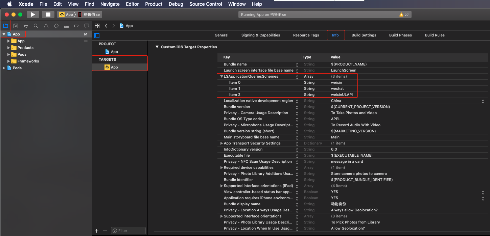
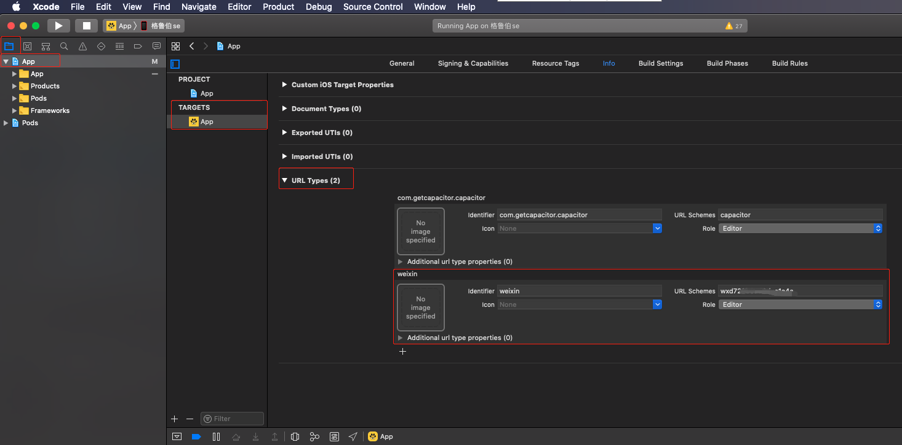
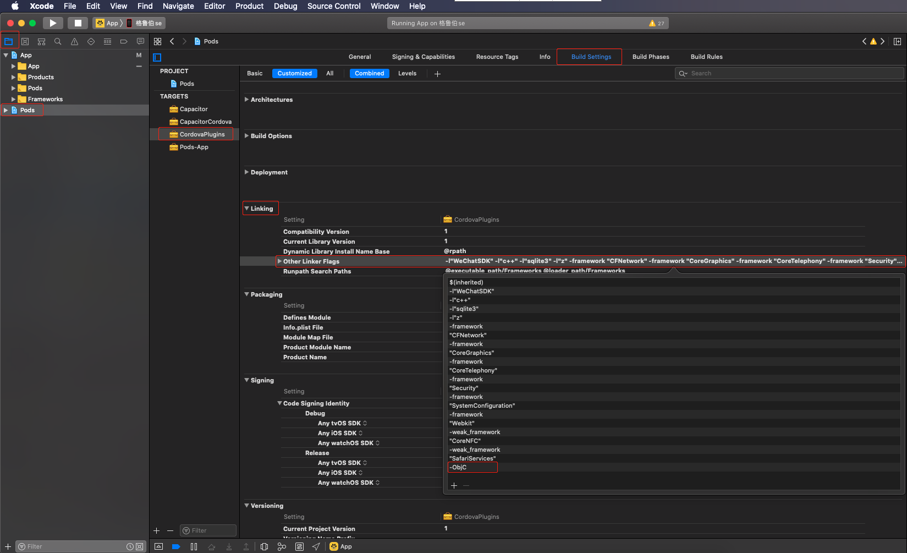

# cordova-plugin-wechat

|环境|版本|
|:-----|:-----|
|@ionic/angular|4.10.0|
|@ionic-native/wechat|5.19.1|
|cordova-plugin-wechat|2.9.0|

```bash
 npm install @ionic-native/wechat
 npm install cordova-plugin-wechat
 npx cap sync
```

# `Android` 部分

> Activity
- 拷贝 `node_modules/cordova-plugin-wechat/src/android/` 目录下 `EntryActivity.java` , `WXEntryActivity.java` , `WXPayEntryActivity.java` 至 `android\app\src\main\java\com\globletech\masses\wxapi`

> config.xml
- `android/app/src/main/res/xml/config.xml` 追加 `WECHATAPPID` 配置
```
<preference name="WECHATAPPID" value="YOUR_WECHATAPPID"/>
```

> AndroidManifest
- 剪切 `android\capacitor-cordova-android-plugins\src\main\AndroidManifest.xml` 中
```
<activity android:name=".wxapi.WXEntryActivity" android:label="@string/launcher_name" android:exported="true" android:taskAffinity="com.globletech.masses" android:launchMode="singleTask">
  <intent-filter>
    <action android:name="android.intent.action.VIEW"/>
    <category android:name="android.intent.category.DEFAULT"/>
    <data android:scheme="$WECHATAPPID"/>
  </intent-filter>
</activity>
<activity android:name=".wxapi.WXPayEntryActivity" android:label="@string/launcher_name" android:exported="true" android:launchMode="singleTop">
  <intent-filter>
    <action android:name="android.intent.action.VIEW"/>
    <category android:name="android.intent.category.DEFAULT"/>
    <data android:scheme="$WECHATAPPID"/>
  </intent-filter>
</activity>
```
- 粘贴至 `android\app\src\main\AndroidManifest.xml` 追加至application里
并修改 `$WECHATAPPID` 为正确的WECHATAPPID,

> 解决 `@string/launcher_name` 报错
>
- 修改 `@string/launcher_name` 为 `@string/app_name` 
- 或者 在 `android/app/src/main/res/values/strings.xml` 中追加 `<string name="launcher_name">SOME_STRING</string>`

> build.gradle

- `android\app\build.gradle` 中 `dependencies` 下添加
```
implementation 'org.apache.cordova:framework:7.0.0'
```

# `iOS` 部分
[iOS SDK接入指南](https://developers.weixin.qq.com/doc/oplatform/Mobile_App/Access_Guide/iOS.html)

> config.xml
- `ios\App\App\config.xml` 中追加
```
  <preference name="WECHATAPPID" value="YOUR_WECHATAPPID"/>
  <preference name="UNIVERSALLINK" value="YOUR_UNIVERSALLINK"/>
```

> TARGETS
- 追加 `LSApplicationQueriesSchemes` 配置

- 追加 `URL Types` 配置

- 追加 `Other Linker Flags` 配置 `-ObjC`


> 事件回调失效
- 可能插件问题，未解决之前可监听APP从后台返回前台事件
```
document.addEventListener("resume", your_handler, false);
```
