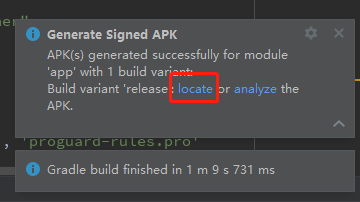

# ionic打包android

|环境|版本|
|:-----|:-----|
|@ionic/core|5.2.3|
|@angular/core|9.1.12|
|Android Studio|4.0.1|

## 命令行运行 `ionic build --prod` 编译web资源

## 命令行运行 `npx cap copy android` 同步编译后资源至android工程

## 打开Android Studio应用

## 依次选择顶部菜单 `Build` -> `Generate Signed Bundle/APK`

## 点击 `APK` -> `Next`

## 点击 `Choose existing...` 选择已存在密钥文件然后填入相关信息
> 或者 `Create new...` 创建新密钥文件

## 选择 `debug` 或 `release`，勾选`V1` `V2`，点击 `Finish` 开始编译

## 编译结束后`Android Studio`右下角弹出小窗，点击`ˇ`展开，点击`locate`弹出文件资源管理器显示编译后APK文件

